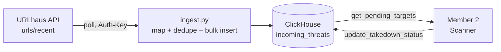

# Member 1: Threat Ingestion & High-Velocity Data Layer

## The "Monitor"

- **Role:** Member 1, Threat Ingestion & High-Velocity Data Layer
- **Sponsor tool:** ClickHouse
- **Status:** All 4 required tasks are done and were checked against the running system
- **In one line:** We pull live malicious URLs, store them fast, and give the next stage a clean list of targets.

---

## Problem & Goal

- Threat feeds publish thousands of malicious URLs, and each one keeps changing.
- The team needs one reliable, queryable store of what is live right now.
- **Goal:** ingest a real threat feed continuously, remove duplicates, and give Member 2 a ranked list of domains to act on.
- **Goal:** record each takedown step without deleting data, so we can measure how fast takedowns happen.

---

## Architecture



Text version:

```
URLhaus API -> ingest.py -> ClickHouse (incoming_threats)
                                 |            ^
                   get_pending_targets()   update_takedown_status()
                                 v            |
                               Member 2 ------+
```

- **ClickHouse:** runs locally in Docker (`clickhouse` service, container `threat-orchestrator-db`, ports 8123/9000, persistent volumes).
- **Ingestion:** runs once, or on a loop every 5 minutes or more (`--interval` ≥ 300). It also supports `--dry-run` and `--self-test` (8/8 pass).
- **Cloud-ready:** you can switch to ClickHouse Cloud through env settings (`CLICKHOUSE_SECURE`). This path has not been tested yet.

---

## Schema: `incoming_threats`

| Column | Type | Notes |
|---|---|---|
| `timestamp` | DateTime | Required. Used as the sort key |
| `target_url` | String | Required |
| `domain` | String | Required |
| `ip_address` | String | Required |
| `threat_type` | String | Required |
| `takedown_status` | String | Required. `DEFAULT 'PENDING'` |
| `event_id` | String | Extra column. URLhaus `id`, used to remove duplicates |
| `feed_source` | LowCardinality(String) | Extra column |
| `first_seen` | DateTime | Extra column. Time of ingestion |

- Engine: `MergeTree ORDER BY timestamp`
- `assert_schema()` rejects any table with the wrong columns.

---

## Hand-off API (for Member 2)

```python
import threatfeed

# PENDING threats grouped by domain, most active first
targets = threatfeed.get_pending_targets(limit=10)
for t in targets:
    print(t["domain"], t["url_count"], t["threat_types"])
    # also: first_seen, last_seen, target_urls, ip_address

# Move a target through the lifecycle
threatfeed.update_takedown_status("SCANNING", domain="example.com")
```

- **Lifecycle:** `PENDING → SCANNING → SCANNED → TAKEN_DOWN / FALSE_POSITIVE`
- Updates can target a domain or a single `event_id`. Only allowed statuses are accepted, and the SQL is parameterized.
- Changes show up immediately. Rows are never deleted, so takedown speed stays measurable.
- The full contract is in `INTERFACE.md`.

---

## Verification & Results

- **`check_setup.py`:** "No blockers". ClickHouse 26.9 is running.
- **Live feed:** URLhaus returned 1000 records, and 50 rows were stored (all PENDING).
- **`tests/smoke_test.py`:** 70/70 checks passed. They cover:
  - schema types and UTC round-trip
  - duplicate handling and sort order
  - status updates and a SQL-injection attempt
- **Live top pending domains:**
  - `tronzadorasnng.com`: 7 URLs
  - `github.com`: 3 URLs
  - `www.tmcksa.com`: 2 URLs

---

## Limitations & Next Steps

- **Only one feed so far (URLhaus).** Every record in the current window is `malware_download`.
  - Next: add crt.sh certificate logs and a phishing list.
- **ClickHouse Cloud is not tested yet.** The config exists, but nobody has run it end-to-end.
- **Hardening:**
  - Move the hardcoded password out of `docker-compose.yml`, and bind ports to localhost.
  - Pin the Docker image and dependency versions.
  - Consider Enum or LowCardinality for `takedown_status`.

---

## Demo Commands

```bash
docker compose up -d            # start ClickHouse
python check_setup.py           # check DB + feed connectivity
python ingest.py --limit 50     # pull live URLhaus threats
python threatfeed.py            # show top pending targets
python tests/smoke_test.py      # run the 70-check smoke test
```

**Takeaway:** Live threat data goes into ClickHouse and comes out as a ranked, trackable target list for Member 2.
