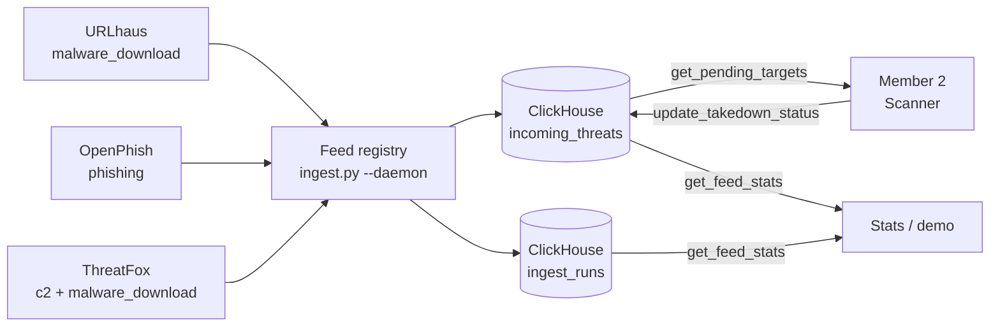

# Member 1: Threat Ingestion & High-Velocity Data Layer

## The "Monitor"

- **Role:** Member 1, Threat Ingestion & High-Velocity Data Layer
- **Sponsor tool:** ClickHouse
- **What's new:** 3 live threat feeds, a hands-off daemon, and run telemetry in ClickHouse
- **In one line:** We pull live malicious URLs from 3 feeds, nonstop, and give the next stage a clean list of targets.

---

## Problem & Goal

- Threat feeds publish thousands of malicious URLs, and each one keeps changing.
- No single feed covers everything: malware, phishing, and command-and-control (C2) each come from different sources.
- **Goal:** ingest several real feeds continuously, with no human in the loop, and remove duplicates.
- **Goal:** give Member 2 a ranked list of domains to act on, and record every takedown step without deleting data.

---

## How We Meet the Judging Criteria

- **Autonomy:**
  - `--daemon` runs nonstop with no manual steps, polling live feeds on per-feed schedules.
  - Errors back off on their own. Each cycle logs a heartbeat.
- **Idea:**
  - It feeds real, current malicious URLs (malware, phishing, C2) straight into a takedown pipeline.
- **Technical Implementation:**
  - Feed registry where each feed's errors are isolated.
  - Dedup on insert, plus an `ingest_runs` telemetry table.
  - A stable contract for Member 2.
- **Tool Use:**
  - ClickHouse is our sponsor tool.
  - The other sponsor tools come from teammates' parts of the pipeline.

---

## Architecture



- **Feeds:** choose them with `--feeds urlhaus,openphish,threatfox` or `--feeds all`. If one feed fails, the others keep running.
- **Daemon schedules:** URLhaus every 300s, OpenPhish and ThreatFox every 600s.
- **On errors:** the wait doubles each time, up to 1 hour.
- **Shutdown:** SIGINT/SIGTERM stops it cleanly. Use `--max-cycles N` for demos.
- **ClickHouse:** runs locally in Docker. A ClickHouse Cloud config exists but has not been tested.

---

## Schema: Two ClickHouse Tables

**`incoming_threats`** (unchanged contract)

- `timestamp`, `target_url`, `domain`, `ip_address`, `threat_type`, `takedown_status` (default `PENDING`)
- Extra columns: `event_id` (used to remove duplicates), `feed_source`, `first_seen`
- Engine: `MergeTree ORDER BY timestamp`. `assert_schema()` rejects any table with the wrong columns.

**`ingest_runs`** (new telemetry)

- `run_ts`, `feed_source`, `fetched`, `mapped`, `inserted`, `duplicates`, `error`, `duration_ms`
- One row per feed attempt, so every success or failure is on record.

---

## Hand-off API (for Member 2)

```python
import threatfeed

# PENDING threats grouped by domain, most active first (unchanged)
targets = threatfeed.get_pending_targets(limit=10)

# Move a target through the lifecycle (unchanged)
threatfeed.update_takedown_status("SCANNING", domain="example.com")

# New: counts by feed, threat type, and status, plus recent runs
stats = threatfeed.get_feed_stats()
```

- **Lifecycle:** `PENDING → SCANNING → SCANNED → TAKEN_DOWN / FALSE_POSITIVE`
- Member 2's contract has not changed.
- `python threatfeed.py --stats` prints the same stats from the command line.
- The full contract is in `INTERFACE.md`.

---

## Verification & Results

- **Live data:** 289 rows in `incoming_threats`, all PENDING.
  - By feed: ThreatFox 119, OpenPhish 100, URLhaus 70
  - By type: malware_download 121, phishing 100, c2 68
- **Daemon demo run:**
  - Cycle 1 inserted 20 new URLhaus rows and 19 new ThreatFox rows.
  - Cycle 2 inserted 0 new rows. Every record was a duplicate, which shows dedup works.
- **Tests:**
  - Self-test: 32/32
  - Smoke test: 82/82
  - Stopping with SIGINT exits with code 0.

---

## Limitations & Next Steps

- **Not verified live:**
  - Backoff against a feed that really fails. Only offline tests cover it.
  - SIGTERM. It uses the same handler as SIGINT.
- **Next feed: crt.sh Certificate Transparency** for brand-lookalike domains.
  - It was planned, but crt.sh was down during development (a timeout, then a 502).
- **ClickHouse Cloud:** the config exists, but nobody has run it end-to-end.
- **Hardening:**
  - Move credentials out of `docker-compose.yml`, and bind ports to localhost.
  - Pin the Docker image and dependency versions.

---

## Demo (3 Minutes)

```bash
docker compose up -d                                                  # 1. start ClickHouse
.venv/bin/python ingest.py --daemon --max-cycles 2 --interval 60 --limit 20
                                                                      # 2. hands-off: cycle 1 inserts, cycle 2 = all duplicates
.venv/bin/python threatfeed.py --stats                                # 3. counts by feed / type / status + recent runs
.venv/bin/python threatfeed.py                                        # 4. ranked pending targets for Member 2
.venv/bin/python tests/smoke_test.py                                  # 5. 82-check smoke test
```

**Takeaway:** 3 live feeds flow into ClickHouse with no one at the keyboard and come out as a ranked, trackable target list for Member 2.
