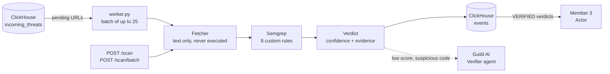

# Member 2: Payload Inspection & Decision Engine

## The "Brain"

- **Role:** Member 2, Payload Inspection & Decision Engine
- **Sponsor tools:** Semgrep, Guild AI
- **What's new:** 8 Semgrep rules for malicious page code, batch scanning, and a Guild agent that reviews what the rules miss
- **In one line:** We take each suspicious URL, read the code it serves, and return a verdict with the exact line that proves it.

---

## Problem & Goal

- A threat feed says a URL is bad. It does not say why, and an abuse desk will not act on "a feed said so".
- Sending an abuse report about a legitimate site is worse than sending none.
- **Goal:** fetch what each URL serves, safely, and find the code that steals data.
- **Goal:** return a verdict the Actor can act on: detected or not, a confidence score, and evidence quoting file and line.
- **Goal:** stay quiet on benign pages, including ordinary login forms.

---

## How We Meet the Judging Criteria

- **Autonomy:**
  - `brain/worker.py` polls pending URLs, scans them in batches and writes verdicts back with no manual step.
  - An interrupted write is repaired on the next poll; a verdict that was saved is never scanned twice.
- **Idea:**
  - Evidence first. Every verdict cites the Semgrep rule, the file and the line, so the abuse report can be checked by a person.
- **Technical Implementation:**
  - Text-only fetcher with size, redirect and private-address limits.
  - Rule weights combine into one confidence score; same-site requests are filtered out.
  - One Semgrep run per batch instead of one per URL.
- **Tool Use:**
  - **Semgrep** does the detection: 8 custom rules over captured HTML, JavaScript and shell scripts.
  - **Guild AI** runs the Verifier agent, which gives a second opinion on scripts the rules did not match.

---

## Architecture



- **Fetcher:** plain HTTP GET, 10-second timeout, 3 redirects, 2 MB cap. Inline scripts are split out and external scripts fetched. Private and loopback addresses are refused.
- **Scan:** one Semgrep run covers every page in the batch.
- **Verdict:** plain Python, no model, so it always returns.
- **Two ways in:** the worker for the autonomous pipeline, and an HTTP service (`/scan`, `/scan/batch`, API key) for the Actor or a Guild tool.

---

## The Rules and the Score

| Rule | Detects | Weight |
|---|---|---|
| `telegram-bot-exfil` | Data sent to a Telegram bot | 0.7 |
| `shell-dropper` | Download, `chmod`, execute | 0.7 |
| `cross-origin-credential-post` | Form values sent to a hard-coded external URL | 0.6 |
| `fake-login-form` | Password form posting to another site | 0.6 |
| `decoded-credential-request` | Password sent to a base64-decoded URL | 0.6 |
| `obfuscated-loader` | `eval` or `document.write` on decoded text | 0.4 |
| `escaped-remote-script` | Percent-encoded remote script tag | 0.4 |
| `obfuscated-redirect` | Redirect to a decoded destination | 0.3 |

- **Confidence** = 1 − ∏(1 − weight) over the distinct rules that matched, so two medium findings outrank one.
- **+0.15** when a threat feed also lists the URL. Capped at 0.99.
- **`VERIFIED`** at 0.6 or above. Otherwise `REJECTED`, or `FETCH_FAILED` if the site is gone.
- Obfuscation alone scores 0.4: suspicious, but not enough to file a report.

---

## Hand-off API (for Member 3)

```python
from brain.pipeline import process_events

pairs = process_events(events)          # [(event, findings), ...] in request order
```

```bash
curl -X POST $BRAIN_URL/scan/batch -H "X-API-Key: $BRAIN_API_KEY" \
  -H "content-type: application/json" -d '{"events":[ ... up to 25 ... ]}'
```

- **In:** the shared event (`event_id`, `target_url`, `timestamp`), plus optional `listed_on_feed`.
- **Out:** the same event with `semgrep_detected`, `confidence_score`, `evidence` and `action_status` filled in, plus a `findings` array for the abuse report.
- `event_id`, `target_url`, `timestamp` and `proof_url` always pass through unchanged.
- The worker appends the same eight fields to the `events` table (`VERDICTS_TABLE`), which the Actor reads.

---

## Guild AI: the Verifier Agent

- Agent `dotimothy~threat-verifier`, built with the Guild CLI and TypeScript SDK, saved as a validated draft.
- **Input:** a scan result plus the captured scripts. **Output:** a JSON verdict with reasoning an abuse desk can follow.
- Tested on Guild's runtime:

| Input | Semgrep said | Verifier said |
|---|---|---|
| Obfuscated credential theft (`window["fe"+"tch"]`, base64 URL) | no match, 0.0 | malicious, 0.99; decoded the collector URL |
| Login form posting to its own site | no match, 0.0 | benign, 0.95 |

- The prompt treats page content as untrusted data, so instructions hidden in a script cannot steer the verdict.
- Its opinion is kept separate from the Semgrep verdict; it does not overwrite it.

---

## Verification & Results

- **Demo pages, end to end:**
  - Fake "Acme Bank" login: `VERIFIED`, 0.95, three rules matched.
  - Benign "Acme Bakery" lookalike: `REJECTED`, 0.0.
- **Labelled samples (15, hand-written):**
  - Semgrep rules: 7 of 7 malicious detected, 0 of 8 benign flagged.
  - Regex baseline: 5 of 7 detected, 7 of 8 benign flagged.
- **Latency per URL, local pages:**
  - Linux: 3.5 s single; 0.5 s each in a batch of 25 (11.8 s total).
  - Windows: 22 s single. Run the scanner on Linux.
- **Tests:** 61 passed, including 8 round-trip tests against a local ClickHouse.
- **Worker, real run on local ClickHouse:** 3 pending rows in, 3 verdict rows out in 4.3 s; a second run found nothing left to do.

---

## Limitations & Next Steps

- **Not verified live:**
  - The worker against the team's shared ClickHouse. It is verified on a local instance only.
  - Real feed URLs. Everything above ran against our own demo pages and samples.
- **Rules are narrow:** the two obfuscation rules were written for the samples they catch. Three of six variations we tried slipped past. The Verifier agent is the answer for those.
- **Guild agent is not yet in the automated path:** it needs a public `/scan` URL to be registered as a Guild tool. The four-tool workflow is written but has not run.
- **Single-rule verdicts score 0.6 to 0.75,** below the Actor's first threshold of 0.80, so they are detected but not actioned.
- **No JavaScript rendering:** a page that builds its form at runtime is seen only as source.
- **Sample set is small and synthetic:** a sanity check, not a benchmark.

---

## Demo (3 Minutes)

```bash
python -m http.server 8765 --bind 127.0.0.1 --directory demo-sites     # 1. our phishing page and a benign lookalike
BRAIN_ALLOW_PRIVATE=1 python -m brain.pipeline \
  http://127.0.0.1:8765/phish/ http://127.0.0.1:8765/benign/           # 2. one batch: VERIFIED 0.95 with file and line, REJECTED 0.0
python -m brain.evaluate                                               # 3. 7 of 7 detected, 0 of 8 false positives, against a regex baseline
python -m brain.worker --once                                          # 4. hands-off: pending rows in, verdict rows out
cd agents/verifier && guild agent test --workspace dotimothy~cyberhack \
  --mode json < ../wrapped-evasive.json                                # 5. Guild agent catches what the rules missed
```

**Takeaway:** every verdict comes with the line of code that proves it, benign pages stay untouched, and a Guild agent backs up the rules on code written to evade them.
