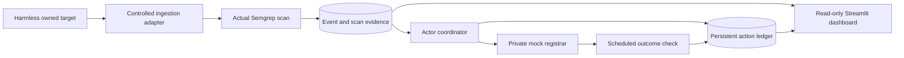

# Takedown Orchestrator

An autonomous cyberdefense pipeline that discovers threat candidates, inspects their
content with Semgrep, dispatches evidence-backed reports, and checks the outcome.
The read-only Streamlit dashboard brings the threat queue, scan evidence, action
receipts, and recorded timeline into one investigation workspace.

Frontend and backend work from PRs [#2](https://github.com/nayeonshin/cyberdefense-hackathon/pull/2),
[#3](https://github.com/nayeonshin/cyberdefense-hackathon/pull/3), and
[#4](https://github.com/nayeonshin/cyberdefense-hackathon/pull/4) is merged into **`main`**.

## Live demo and current status

**[Open the Akash dashboard](https://rlts1sj4jhcur9q89cjbfn8omk.ingress.h6i-dedicated.eu-se-1.digitalfrontier.so/)**

As verified on **October 9, 2026**, the deployed application runs a controlled demonstration:
it discovers a harmless team-owned page, executes a real Semgrep scan, submits to a
private mock registrar, and observes the target return HTTP 410. External reporting
channels remain disabled. The cloud run uses **file-backed persistence**, not the
shared ClickHouse backend or simulated fixtures.

| Integration | Verified use |
| --- | --- |
| Semgrep | Actual CLI execution, saved findings, rule IDs, and source-line evidence in the controlled run. |
| Akash Network | Public dashboard and independent background processes on a sponsor-funded provider lease. |
| ClickHouse | Native backend adapter and real database pipeline verified in CI; the current public demo is not connected to the shared database. |
| Guild AI | Not used. Optional legacy source is inactive and is not counted as an integration. |

The demo video has been recorded; its accessible URL and final submission details
are not yet linked here. Sponsor eligibility and submission confirmation remain
separate from technical validation.

## Architecture

| Component | Responsibility | Source |
| --- | --- | --- |
| Ingestion | Feed adapters, threat candidates, deduplication, and ClickHouse ingestion | `ingest.py` |
| Scanner | Fetching, Semgrep rules, structured verdicts, and evaluation | `brain/`, `semgrep-rules/` |
| Actor | Reporting, receipts, durable duplicate suppression, and outcome rechecks | `actor/` |
| Integration and UI | Data adapters, controlled pipeline, process supervision, and dashboard | `shipper/`, `dashboard.py` |

The current deployed controlled path is:



The supervisor runs the dashboard, coordinator, and controlled pipeline as separate
processes. The coordinator serializes dispatch and rechecks with the same ledger.
Browser refreshes, row selection, and reconnects do not start another worker or
trigger an action. The dashboard refreshes every two seconds; its animated overview
and evidence replay are presentation only.

The shared event contract retains exactly these eight fields:

```text
event_id, target_url, timestamp, semgrep_detected,
confidence_score, evidence, action_status, proof_url
```

Ingestion timing, scan completion, and run metadata are stored separately. The UI
derives action progress from receipts matched to the event and target. It distinguishes
pending scans, "No rule matched," detections, failures, submitted reports, saved test
messages, and historical or freshly checked unavailability. Targets are defanged,
evidence is escaped, and only validated HTTP(S) proof links become clickable.

## Run locally

Use **Python 3.12**. From a fresh checkout in PowerShell:

```powershell
python -m venv .venv
.\.venv\Scripts\python.exe -m pip install -r requirements-dev.txt
.\.venv\Scripts\python.exe -m shipper.supervisor
```

Open <http://localhost:8501>. With no configuration overrides, this starts a
**Simulated data** preview that never dispatches reports. Ctrl+C stops the supervisor.
Existing `.env`, `clickhouse.env`, and process environment values can override defaults.

For the containerized preview, start Docker Desktop with Linux containers and run:

```powershell
docker compose -f compose.yaml up --build
```

`compose.yaml` runs the application with a named runtime volume. The separate
`docker-compose.yml` is a development ClickHouse service, not the application stack.

To execute the real harmless demonstration, follow the environment and startup
commands in [Controlled run](docs/CONTROLLED_RUN.md). Use a new `RUN_ID` for each
deliberate demonstration and retain that run's ledger across restarts.

## Connect the team backend

The data sources are explicit; connection failures never silently switch to fixtures.

| `DATA_SOURCE` | Purpose | `RUN_MODE` |
| --- | --- | --- |
| `fixtures` | Labeled simulated UI preview; no dispatch | `preview` |
| `files` | Saved event metadata and Actor receipts; current Akash demo | `preview` or `controlled` |
| `clickhouse` | Controlled pipeline database adapter using `EVENTS_TABLE=shipper_events` | `preview` or `controlled` |
| `backend` | Read-only projection of Members 1–3's native tables | `preview` |

For an existing backend, put connection settings in an ignored `.env` or
`clickhouse.env` file, then launch only the dashboard:

```powershell
$env:DATA_SOURCE = 'backend'
$env:RUN_MODE = 'preview'
$env:THREATS_TABLE = 'incoming_threats'
$env:VERDICTS_TABLE = 'events'
$env:ACTIONS_TABLE = 'actions'
.\.venv\Scripts\python.exe -m streamlit run dashboard.py
```

Use the backend's actual table namespace, such as `akash_threats`, `akash_events`,
and `akash_actions`, when configured. Here, `preview` means the dashboard performs
no actions; the displayed backend records are real data. Members 1–3's services
continue to own ingestion, scanning, and dispatch. The dashboard needs SELECT access
and does not create backend tables. Backend worker heartbeats are not exposed by
the current schema, so the UI reports that limitation explicitly.

See [Frontend/backend integration](docs/FRONTEND_BACKEND_INTEGRATION.md) for schema
projection and [`.env.example`](.env.example) for variable names. A database credential
was previously committed upstream and must be rotated before connecting the shared
service. Never commit credentials or sponsor redemption codes, or place secrets in
public SDL. Process environment variables take precedence over dotenv files.

## Akash deployment

CI builds a pinned Linux/AMD64 Python 3.12 image and publishes it to public GHCR
only after its tests pass. The SDL declares the image, resources, network port,
and persistent volume. A selected Akash provider pulls and runs the container.

| Deployment detail | Verified value |
| --- | --- |
| Deployed code | [`a06094c`](https://github.com/nayeonshin/cyberdefense-hackathon/commit/a06094ccc570893fc12372a902ef7870bea4e6f3) |
| Image | `ghcr.io/nayeonshin/cyberdefense-hackathon:a06094ccc570893fc12372a902ef7870bea4e6f3` |
| Image digest | `sha256:2b5f29e132900d46c74dcf051b8b99ad9c515c1b4cbcc4eb92e924d463dd6d1e` |
| Lease | [DSEQ 1791578237742](https://console.akash.network/deployments/1791578237742) |
| Provider | `provider.h6i-dedicated.eu-se-1.digitalfrontier.so` |
| Resources | One replica, 2 CPUs, 4 GiB RAM, 5 GiB ephemeral storage, 1 GiB persistent storage at `/data` |
| Networking | Streamlit 8501 exposed as public port 80 through the provider ingress; mock registrar remains private |
| Persisted run | `akash-controlled-001` |
| Funding | Existing sponsor credits; quoted rate $5.18/month, with a 24-hour runtime cap |
| Rollback image | `ghcr.io/nayeonshin/cyberdefense-hackathon:495ea49ea4f1a1a3ed5aa31fdeba78dffb38e434` |

The lease is time-limited; this URL is not a promise of indefinite availability.
The image update preserved the run ID, volume, all three receipts, and exactly
one submitted report. The restarted worker recorded a fresh HTTP 410 check, and
the public dashboard's refresh and reconnect behavior was verified. Persistent
storage survives container restarts within the lease; backups are needed for
provider changes or lease closure.

See [Deployment runbook](docs/DEPLOYMENT.md) and [SDL template](deploy.yaml).
Earlier rollout documents record historical images and checks; the deployment
table above supersedes their release status. Documentation-only commits after
`a06094c` do not require rebuilding the deployed application.

## Validation

```powershell
.\.venv\Scripts\python.exe -m pytest -q
```

[Merged-main CI run 38003927990](https://github.com/nayeonshin/cyberdefense-hackathon/actions/runs/38003927990)
passed **152 tests with 10 opt-in skips**, followed by **all 8 native ClickHouse
integration tests** against a disposable database. The real ClickHouse/Semgrep/Actor
controlled pipeline completed in **12.603 seconds**. Container checks verified
persistent-volume restart, database outage/recovery, duplicate suppression, health,
and visible failure after a forced worker exit.

The Akash file-backed run retains its original **15.054-second** discovery-to-confirmation
record. Its ledger checksum stayed unchanged through the production update. CI
ClickHouse evidence and cloud file-mode evidence are separate; neither is a claim
that an external registrar removed a real malicious site.

The current workflow runs automatically on `member4-shipper` and
`integration/frontend-backend`; builds from `main` are started with its manual
`workflow_dispatch` trigger. Publishing an image does not automatically update Akash.

## Further documentation

- [Ingestion plan](MEMBER1_PLAN.md)
- [Scanner setup and behavior](brain/README.md)
- [Actor setup and reporting channels](actor/README.md)
- [Team handoff](docs/TEAM_HANDOFF.md)
- [Three-minute presentation and submission checklist](docs/DEMO_AND_SUBMISSION.md)
- [Historical QA report](docs/QA_REPORT.md)
- [Animated overview implementation and earlier rollout](docs/MOTION_ROLLOUT.md)
