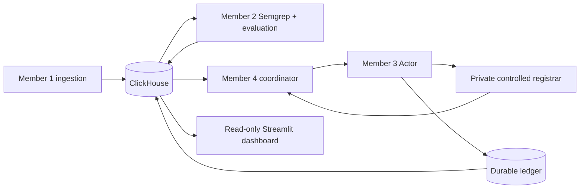

# Takedown Orchestrator — Member 4

Streamlit operations dashboard, a single durable Actor coordinator, and Akash deployment packaging.
The default preview uses **clearly labeled simulated data** and never dispatches reports.

## Run locally

Python 3.12:

```powershell
python -m venv .venv
.\.venv\Scripts\python.exe -m pip install -r requirements-dev.txt
.\.venv\Scripts\python.exe -m shipper.supervisor
```

Open <http://localhost:8501>. The supervisor owns the dashboard and worker independently.
Closing or refreshing a browser does not start or stop the worker. Ctrl+C stops the supervisor.
For Docker, run `docker compose up --build` (Linux containers). The named volume preserves runtime state.

## Integration

- [Team handoff and exact interfaces](docs/TEAM_HANDOFF.md)
- [Real controlled Semgrep run](docs/CONTROLLED_RUN.md)
- [Akash and container runbook](docs/DEPLOYMENT.md)
- [Three-minute script and submission checklist](docs/DEMO_AND_SUBMISSION.md)
- [Reference ClickHouse schema](integration/reference-schema.sql)
- [Member 3 Actor documentation](actor/README.md)
- [Full QA findings and validation](docs/QA_REPORT.md)
- [Animated overview and rollout validation](docs/MOTION_ROLLOUT.md)



The exact eight-field event stays intact. Ingestion and scan metadata sit beside it. Receipts are append-only,
joined by `event_id`; the UI does not equate a report submission with an external takedown.

## Verify

```powershell
.\.venv\Scripts\python.exe -m pytest -q
```

Actor unit tests use test-provided verdicts. The team integration test additionally executes Member 2's
actual Semgrep CLI against the harmless owned page, saves findings, and verifies one receipt plus confirmed
suspension across a coordinator restart. File-mode execution is not ClickHouse, Guild or Akash evidence.
The final sponsor recording still requires a reachable external ClickHouse instance. Akash is deployed;
see [current deployment evidence](docs/RAMP_ROLLOUT.md) for its URL, expiry and integration boundaries.

## Current integration boundaries

The original two Actor commits and snapshots of Member 1's ingestion and Member 2's Python scanner are
integrated without modifying their files. The controlled adapter supplies a long-running entrypoint;
Member 1's ClickHouse is currently localhost-only and Guild run traces remain pending.
No API credentials or sponsor redemption codes belong in Git.
`RUN_MODE=controlled` is deliberately limited to the private harmless target. Third-party reporting switches
are forced off for this demo; configure general live operation with Member 3 separately.
