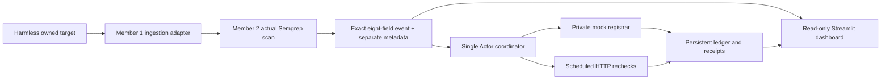

# Deployment and integration evidence

Verified October 9, 2026. This document records a controlled demonstration, not an external takedown.

## Running service

- Dashboard: <https://j37o2jgnu9bq57cesbda28htdc.ingress.akash-palmito.org/>
- Console: <https://console.akash.network/deployments/1791574764504>
- Provider: Akash Palmito, `provider.akash-palmito.org`
- Image: `ghcr.io/nayeonshin/cyberdefense-hackathon:2ae9e2d4308f230f4c24b482170535f9634004a5`
- Digest: `sha256:c5e0766119b291edff48ee0d790b082815432128d549025a7767f3f31b26130e`
- Run: `akash-controlled-001`; 2 vCPU, 4 GiB RAM, 5 GiB ephemeral and 1 GiB persistent `/data`.
- One replica; Streamlit 8501 exposed as public 80; mock registrar private on loopback.
- Existing coupon credits fund the $5.38/month quote. A 24-hour runtime limit ends approximately October 10 at 12:44 PM PDT. No payment method or paid funding was added.

The public health endpoint returned 200. Browser reconnect showed a live worker heartbeat, advancing two-second
refreshes, one event, one detection, and one submitted action. The current source is `files`; cloud ClickHouse
connectivity is pending. A saved test message is separately labeled and excluded from submitted actions.

## Architecture

Akash hosts the worker, team pipeline, private target and dashboard as separate supervised processes. The cloud
run uses persistent files. Linux validation uses a separate real ClickHouse container for events, metrics and
receipts. Opening a browser never starts a worker or dispatches an action.

## Measured cloud run

| Stage | UTC timestamp |
|---|---|
| Ingestion | 2026-10-09T19:44:36.295279Z |
| Actual Semgrep completed | 2026-10-09T19:44:40.395557Z |
| Mock registrar submitted, ticket T-0001 | 2026-10-09T19:44:42.419Z |
| HTTP 410 confirmed | 2026-10-09T19:44:48.533Z |

Elapsed: **12.238 seconds**. Semgrep matched `fake-login-form`, lines 6–7, confidence 0.60. The form uses an
invalid collection domain, disabled inputs and a restrictive content security policy. External reporting is off.

The original run used image `b6d594499c096ae305afa74688527783628c2918`. Updating to the current image preserved
the event and single submission. The new worker started at `19:55:24.479845Z`; the read-only acceptance probe
observed a fresh check at `19:56:55.892743Z`. A later public browser reconnect still showed one submitted action.

## Repeatable container evidence

[Validation run 37982475135](https://github.com/nayeonshin/cyberdefense-hackathon/actions/runs/37982475135)
passed **42 tests** and completed the real ClickHouse → Semgrep → Actor pipeline in **12.947 seconds**.
Its `controlled-pipeline-evidence` artifact includes scan findings, exact event data, receipts, a target check,
and acceptance results before and after restarting the same persistent volume. The worker start changes from
`19:48:10.560371Z` to `19:48:26.126939Z`; the submitted receipt count remains one.

## Sponsor claims and remaining work

Semgrep and Akash are verified in the public controlled deployment. ClickHouse is verified in the Linux container
run, and is not connected to the current cloud deployment. Guild AI needs Member 2's actual integration trace.
Prize eligibility is separate from technical execution evidence and must be checked against the event rules.

The final three-minute recording, accessible video URL, team details, prize selections, and submission confirmation
remain pending. No submission has been sent. Team fields are deliberately omitted rather than filled with placeholders.
